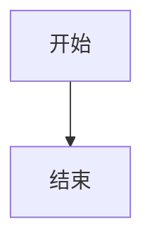

# 完整 Pipeline 流程使用指南

## 概述

当使用 `publish_wechat` 工具发布 Markdown 文件到微信公众号时，可以启用完整的自动化流程：

1. **Mermaid 转换**：自动检测并转换所有 Mermaid 代码块为 PNG 图片
2. **代码备份**：保存原始 Mermaid 代码到 `.mermaid-backup` 目录
3. **图片收集**：收集所有本地图片（包括 Mermaid 生成的图片）
4. **COS 上传**：上传所有图片到腾讯云 COS
5. **链接替换**：自动替换 Markdown 中的本地图片链接为 COS URL
6. **主题渲染**：应用主题样式
7. **发布到微信**：提交到微信公众号草稿箱

## 使用方法

### 通过 MCP 工具调用

```json
{
  "name": "publish_wechat",
  "arguments": {
    "filePath": "/path/to/your/article.md",
    "theme": "orangeheart",
    "runPipeline": {
      "convertMermaid": true,
      "uploadImages": true
    }
  }
}
```

### 参数说明

- `filePath`（必需）：Markdown 文件的绝对路径
- `theme`（可选）：主题 ID，默认使用配置文件中的主题
- `runPipeline`（可选）：Pipeline 配置对象
  - `convertMermaid`（布尔值，默认 `false`）：是否转换 Mermaid 代码块为图片
  - `uploadImages`（布尔值，默认 `false`）：是否上传图片到 COS

### 默认行为

**如果不设置 `runPipeline` 参数**，或设置但两个选项都为 `false`：

- ✅ 直接读取 Markdown 文件内容（不进行任何转换）
- ✅ 应用主题样式
- ✅ 发布到微信公众号草稿箱

**不会执行的操作：**
- ❌ 不会转换 Mermaid 代码块（如果文件中有 Mermaid 代码，会保持原样）
- ❌ 不会上传图片到 COS（本地图片路径保持原样）
- ❌ 不会替换图片链接

这意味着，默认情况下 `publish_wechat` 的行为就是传统的"直接发布"模式，适用于：
- 文件中没有 Mermaid 代码块
- 图片已经使用外部 URL（如 CDN、GitHub 等）
- 只需要快速发布，不需要额外处理

### 工作流程示例

假设你有一个 Markdown 文件 `article.md`：

```markdown
---
title: "我的文章"
---

# 我的文章

这是一段文字。

## 流程图



这里还有一张本地图片：


```

当调用 `publish_wechat` 并启用 Pipeline 后：

1. **Mermaid 转换**：
   - 检测到 1 个 Mermaid 代码块
   - 转换为 `.assets/article__mmd_0.png`
   - 原始代码保存到 `.assets/.mermaid-backup/article__mmd_0.mmd`

2. **图片收集**：
   - 找到 2 个图片：
     - `.assets/article__mmd_0.png`（Mermaid 生成的）
     - `images/local.png`（原始本地图片）

3. **COS 上传**：
   - 上传到 `articles/2025/11/article__mmd_0.png`
   - 上传到 `articles/2025/11/local.png`

4. **链接替换**：
   - 原文中的 Mermaid 代码块被替换为：
     ```markdown
     
     ```
   - 本地图片链接被替换为：
     ```markdown
     
     ```

5. **发布**：
   - 应用主题样式
   - 提交到微信公众号草稿箱

## 文件结构

处理后的文件结构：

```
your-article.md              # 原始文件（保持不变，备份为 .backup）
.assets/
  ├── article__mmd_0.png     # Mermaid 生成的图片
  └── .mermaid-backup/       # 原始 Mermaid 代码备份
      └── article__mmd_0.mmd
```

## COS 配置

确保已正确配置 COS 信息（见 `docs/COS_SETUP_GUIDE.md`）：

```env
COS_SECRET_ID=your_secret_id
COS_SECRET_KEY=your_secret_key
COS_REGION=ap-shanghai
COS_BUCKET=your-bucket-name
COS_BASE_URL=https://your-bucket.cos.region.myqcloud.com
```

## 高级配置

### 自定义 COS 路径前缀

在调用 Pipeline 时，可以通过 `cosOptions` 指定路径前缀：

```javascript
executePipeline({
  filePath: "article.md",
  convertMermaid: true,
  uploadImages: true,
  cosOptions: {
    keyPrefix: "blog/2025/",  // 自定义前缀
    overwrite: false,          // 不覆盖已存在的文件
  },
});
```

### Mermaid 选项

可以自定义 Mermaid 转换选项：

```javascript
executePipeline({
  filePath: "article.md",
  convertMermaid: true,
  mermaidOptions: {
    format: "png",
    scale: 2,
    background: "#ffffff",
    handDrawn: {
      enabled: true,
      roughness: 1.5,
      randomizeColors: true,
    },
  },
});
```

## 测试完整流程

使用提供的测试脚本：

```bash
node test/test-pipeline.js
```

这会：
1. 处理 `test/test-full-pipeline.md`
2. 转换所有 Mermaid 代码块
3. 上传所有图片到 COS
4. 替换所有链接
5. 显示详细的执行结果

## 注意事项

1. **文件备份**：原始 Markdown 文件会被更新，建议启用 Git 版本控制或手动备份
2. **原始代码备份**：所有原始 Mermaid 代码都会保存在 `.mermaid-backup` 目录中，便于后续修改
3. **错误处理**：如果某个步骤失败，Pipeline 会继续执行其他步骤，并在最后报告所有错误
4. **COS 路径**：生成的 COS Key 格式为 `{keyPrefix}/{year}/{month}/{filename}`
5. **手绘风格**：如果启用了手绘风格，甘特图和饼图会自动跳过手绘效果（保持精确显示）

## 故障排查

### Mermaid 转换失败

- 检查是否安装了 `@mermaid-js/mermaid-cli`
- 检查 Mermaid 代码语法是否正确

### COS 上传失败

- 检查 COS 配置是否正确（`.env` 文件）
- 检查网络连接
- 检查 COS 权限设置

### 图片链接未替换

- 确保图片路径是相对路径（相对于 Markdown 文件）
- 检查 `collectLocalImagesFromFile` 是否正确识别图片

## 示例输出

成功执行后的输出示例：

```
🚀 开始测试完整 Pipeline 流程...
📄 文件: /path/to/article.md

[INFO] 开始执行 Pipeline
[INFO] 步骤 1: 转换 Mermaid 代码块...
[INFO] 找到 2 个 mermaid 代码块
[INFO] 已渲染 mermaid 图表 1/2
[INFO] 已渲染 mermaid 图表 2/2
[INFO] 已转换 2 个 Mermaid 图表
[INFO] 步骤 2: 收集本地图片...
[INFO] 找到 3 个本地图片
[INFO] 步骤 3: 上传图片到 COS...
[INFO] 成功上传 3 个图片
[INFO] 步骤 4: 回写图片链接...
[INFO] 图片链接回写完成
[INFO] Pipeline 执行成功

✅ Pipeline 执行完成！

📊 执行结果：
  Mermaid 图表: 2 个
  收集的图片: 3 个
  上传成功: 3 个
  错误数量: 0 个

🌐 上传的图片 URL：
  1. https://your-cos-url.com/articles/2025/11/article__mmd_0.png
  2. https://your-cos-url.com/articles/2025/11/article__mmd_1.png
  3. https://your-cos-url.com/articles/2025/11/local.png
```

## 总结

完整的 Pipeline 流程实现了：

✅ **自动化**：一键完成所有图片处理步骤  
✅ **备份保护**：原始代码和文件都有备份  
✅ **错误容忍**：单个步骤失败不影响其他步骤  
✅ **灵活配置**：支持自定义路径、样式等选项  
✅ **完整追踪**：详细的日志和结果报告  

现在你可以专注于编写内容，而不用担心图片处理、上传和链接替换的繁琐操作！

