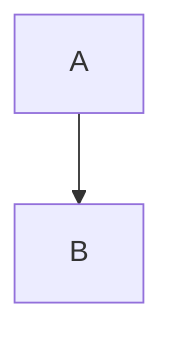

# 仅测试转换和上传（不发布到微信公众号）

如果你想测试 Mermaid 转换和图片上传功能，但**不发布到微信公众号**，可以使用单独的工具。

## 方法 1: 分步执行（推荐）

### 步骤 1: 转换 Mermaid 代码块为图片

**提示词：**
```
请使用 convert_mermaid 工具处理文件：[你的Markdown文件绝对路径]
```

**示例：**
```
请使用 convert_mermaid 工具处理文件：/Users/xuyehua/Code/markdown2wechat-mcp/test/test-full-pipeline.md
```

**可选：启用手绘风格（默认关闭）**

⚠️ **注意**：手绘风格默认是**关闭**的，需要显式启用。

```
请使用 convert_mermaid 工具处理文件：[文件路径]，启用手绘风格，随机化颜色和填充样式
```

### 步骤 2: 上传图片到 COS

**提示词：**
```
请使用 image_upload_cos 工具上传文件中的所有图片：[你的Markdown文件绝对路径]
```

**示例：**
```
请使用 image_upload_cos 工具上传文件中的所有图片：/Users/xuyehua/Code/markdown2wechat-mcp/test/test-full-pipeline.md
```

## 方法 2: 一键执行两个步骤

**提示词：**
```
请先使用 convert_mermaid 工具处理文件：[文件路径]，然后使用 image_upload_cos 工具上传该文件中的所有图片。
```

**完整示例：**
```
请先使用 convert_mermaid 工具处理文件：/Users/xuyehua/Code/markdown2wechat-mcp/test/test-full-pipeline.md，然后使用 image_upload_cos 工具上传该文件中的所有图片。
```

## 执行效果

完成这两个步骤后，你的 Markdown 文件会：

1. ✅ **所有 Mermaid 代码块被替换**为图片链接
   - 第一步后：本地图片链接（如 ``）
   - 第二步后：COS URL（如 ``）
2. ✅ **原始 Mermaid 代码已备份**到 `.assets/.mermaid-backup/` 目录（`.mmd` 文件）
3. ✅ **图片已上传**到腾讯云 COS
4. ✅ **文件中的所有 Mermaid 代码块都已被替换**，不会保留原始代码块
5. ❌ **不会发布**到微信公众号

**重要说明：**
- **手绘风格默认关闭**：如果需要手绘风格效果，需要在调用时显式启用
- **完整替换**：原文章中的所有 Mermaid 代码块都会被转换成上传到 COS 的图片链接

## 工具参数说明

### `convert_mermaid` 工具

- `filePath`（必需）：Markdown 文件的绝对路径
- `outDir`（可选）：输出目录，默认使用配置文件中的 `output.dir`
- `format`（可选）：图片格式，`png` 或 `jpg`，默认 `png`
- `scale`（可选）：缩放比例，默认 `1`
- `background`（可选）：背景颜色，默认 `#ffffff`
- `engine`（可选）：渲染引擎，`local` 或 `kroki`，默认 `local`
- `handDrawn`（可选）：手绘风格选项

### `image_upload_cos` 工具

- `filePath`（必需）：Markdown 文件的绝对路径
- `keyPrefix`（可选）：COS 路径前缀，如 `articles/2025/10/`
- `overwrite`（可选）：是否覆盖已存在的文件，默认 `false`

## 验证结果

执行后，检查你的 Markdown 文件：

**转换前（原始 Mermaid 代码块）：**
```markdown

```

**转换后（仅 convert_mermaid，代码块已替换为本地图片链接）：**
```markdown

```
✅ 原始 Mermaid 代码已备份到 `.assets/.mermaid-backup/article__mmd_0.mmd`

**上传后（convert_mermaid + image_upload_cos，本地链接替换为 COS URL）：**
```markdown

```

**重要确认：**
- ✅ 原文章中的所有 ` ```mermaid ... ``` ` 代码块都会被完全替换
- ✅ 替换后的内容是图片链接（不是代码块）
- ✅ 原始代码保存在备份目录中，不会丢失

## 注意事项

1. **文件会被修改**：
   - 原始 Markdown 文件中的所有 Mermaid 代码块都会被替换成图片链接
   - 所有本地图片链接都会被替换成 COS URL
   - **不会保留任何 Mermaid 代码块在最终文件中**

2. **备份保护**：
   - 原始 Mermaid 代码会保存在 `.assets/.mermaid-backup/` 目录（`.mmd` 文件）
   - 可以随时从备份文件中恢复原始代码

3. **手绘风格默认关闭**：
   - 默认情况下，Mermaid 图表以标准样式渲染
   - 如果需要手绘风格，必须显式启用（见上方示例）

4. **需要 COS 配置**：`image_upload_cos` 需要正确的 COS 配置（`.env` 文件）

5. **需要 Mermaid CLI**：`convert_mermaid` 需要安装 `@mermaid-js/mermaid-cli`

